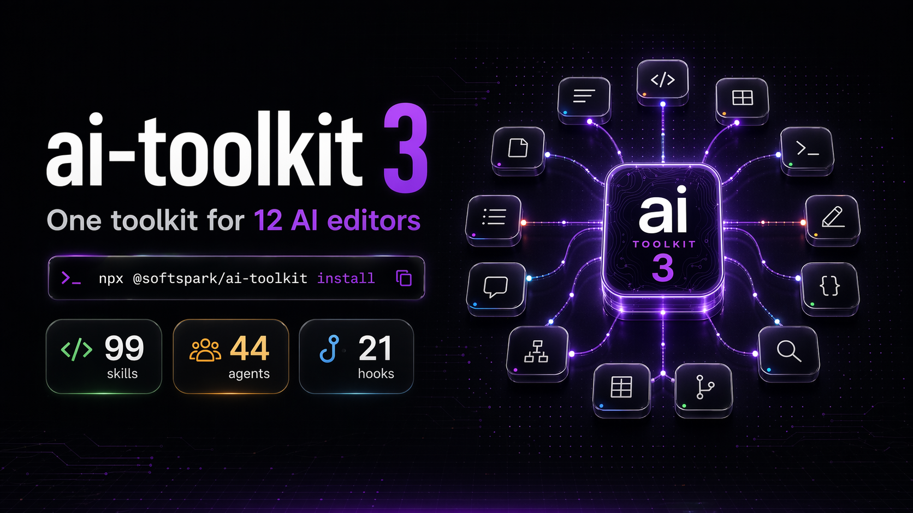

# ai-toolkit

> Professional-grade AI coding toolkit with multi-platform support. Machine-enforced safety, 99 skills, 44 agents, expanded lifecycle hooks, persona presets, experimental opt-in plugin packs, and benchmark tooling — works with Claude, Cursor, Windsurf, Copilot, Gemini, Cline, Roo Code, Aider, Augment, Google Antigravity, Codex CLI, and opencode, ready in 60 seconds.

[](https://github.com/softspark/ai-toolkit/actions/workflows/ci.yml)
[](LICENSE)
[](app/skills/)
[](app/agents/)
[](tests/)

<p align="center">
  
</p>

---

## What's New in v3.0.2

**3.0.2 is a patch release** that closes known validation gaps, expands the validated hook surface, adds Windows dependency hints, exposes local product telemetry, and restores `npm run generate:all` parity with the CLI.

- `validate.py` now checks hook handler types, required handler fields, prompt/agent event compatibility, and structured language-rule frontmatter/category coverage.
- Hook docs and validation now cover `PostToolUseFailure`, `PostToolBatch`, `UserPromptExpansion`, plus `command`, `http`, `prompt`, `agent`, and `mcp_tool` handler types.
- `ai-toolkit stats --summary` reports local product telemetry: total invocations, unique skills used, catalog coverage, unused skills, recent activity, and top skills.
- Windows dependency detection now emits package hints for `winget`, Chocolatey, and Scoop; WSL remains the recommended runtime for Bash hooks.
- `npm run generate:all` now invokes every directory-based rule generator, so registered custom rules in `~/.softspark/ai-toolkit/rules/` propagate to every editor that supports per-rule module files.

### Carried from v3.0.0 (feature release)

- **Deep coverage: every editor at 100% of its native surface.** New generators emit hooks, sub-agents, custom commands, and skill pointers per editor: `generate_cursor_agents.py`, `generate_cursor_hooks.py`, `generate_windsurf_hooks.py`, `generate_gemini_commands.py`, `generate_gemini_hooks.py`, `generate_gemini_skills.py`, `generate_augment_agents.py`, `generate_augment_commands.py`, `generate_augment_hooks.py`, `generate_augment_skills.py`, `generate_codex_skills.py`.
- **`--profile full`** turns on every native surface across all supported editors in one flag. `minimal` / `standard` / `strict` retain prior semantics but `standard` now also wires Gemini hooks and the Copilot directory layout (see Breaking Changes).
- **Opt-in Codex skill mirroring** via `--codex-skills`. Codex gets the full skill catalog materialized under `.agents/skills/`; other editors stay on pointer-skill or compat-read.
- **58 new bats tests** covering native surface generators plus per-editor suites for aider, antigravity, augment, claude-code, cline, codex, copilot, cursor, gemini, opencode, roo, windsurf.
- **Skill quality pass** (folded in from the 2.12 work that is now skipped): 62 skills upgraded to 4-5 / 5 on the meta-architect audit; `add_gotcha` added as a fifth mutation strategy.

### Breaking changes (from 3.0.0)

- `--profile standard` now installs **Gemini hooks** automatically. To opt out, use `--profile minimal` or pass `--skip gemini-hooks`.
- Copilot now uses the **directory layout** (`.github/copilot/`) instead of a single monolithic file. Existing single-file installs are preserved but new installs emit the directory form.
- `2.13.0` is skipped. Upgrade path is `2.12.x` → `3.0.0`.

### Non-breaking additions (opt-in)

- `.windsurf/hooks.json`, `.cursor/hooks.json`, `.cursor/agents/`, `.augment/agents/`, `.augment/commands/`, `.gemini/commands/`, and `.codex/skills/` are **only emitted when you opt in** via `--profile full` (or `--codex-skills` for the Codex mirror). Existing projects that upgrade to 3.0.0 without changing their install flags will see no new files in those directories — the native surfaces stay dormant until you ask for them.

See [CHANGELOG.md](CHANGELOG.md) for full history.

---

## Table of Contents

- [Install](#install)
- [Platform Support](#platform-support)
- [What You Get](#what-you-get)
- [Architecture](#architecture)
- [Key Features](#key-features)
- [Key Slash Commands](#key-slash-commands)
- [Getting Started](#getting-started)
- [Documentation](#documentation)
- [Contributing](#contributing)

---

## Install

```bash
# Option A: install globally (once per machine)
npm install -g @softspark/ai-toolkit
ai-toolkit install

# Option B: try without installing (npx)
npx @softspark/ai-toolkit install
```

**That's it.** Claude Code picks up 99 skills, 44 agents, quality hooks, and the safety constitution automatically.

**Windows:** WSL is the recommended runtime. Native Windows works when Git Bash is available for hook scripts; dependency hints cover `winget`, Chocolatey, and Scoop. See [Windows Support](kb/reference/windows-support.md).

### Update

```bash
npm install -g @softspark/ai-toolkit@latest && ai-toolkit update
```

### Per-Project Setup

```bash
cd your-project/
ai-toolkit install --local                        # Claude Code only
ai-toolkit install --local --editors all          # + all editors
ai-toolkit install --local --editors cursor,aider # + specific editors
ai-toolkit update --local                         # auto-detects editors
```

### Plugin Management

```bash
ai-toolkit plugin list                            # show available packs
ai-toolkit plugin install --editor all --all      # install all for Claude + Codex
ai-toolkit plugin status --editor all             # show what's installed
```

### Install Profiles

```bash
ai-toolkit install --profile minimal    # agents + skills only
ai-toolkit install --profile standard   # full install (default)
ai-toolkit install --profile strict     # full + git hooks
```

### Verify & Repair

```bash
ai-toolkit validate          # check integrity
ai-toolkit doctor --fix      # auto-repair
```

See [CLI Reference](kb/reference/cli-reference.md) for all commands and options.

---

## Platform Support

| Platform | Config Files | Scope |
|----------|-------------|-------|
| Claude Code | `~/.claude/` | global |
| Cursor | `~/.cursor/rules` + `.cursor/rules/*.mdc` | global + project |
| Windsurf | `~/.codeium/.../global_rules.md` + `.windsurf/rules/*.md` | global + project |
| Gemini CLI | `~/.gemini/GEMINI.md` | global |
| GitHub Copilot | `.github/copilot-instructions.md` | project |
| Cline | `.clinerules/*.md` | project |
| Roo Code | `.roomodes` + `.roo/rules/*.md` | project |
| Aider | `.aider.conf.yml` + `CONVENTIONS.md` | project |
| Augment | `.augment/rules/ai-toolkit-*.md` | project |
| Google Antigravity | `.agent/rules/*.md` + `.agent/workflows/*.md` | project |
| Codex CLI | `AGENTS.md` + `.agents/rules/*.md` + `.agents/skills/*` + `.codex/hooks.json` | project + global plugin |
| opencode | `AGENTS.md` + `.opencode/{agents,commands,plugins}/*` + `opencode.json` | project + global (`~/.config/opencode/`) |

> Claude Code is always installed (primary platform). Other editors on demand with `--editors`. All platforms receive the same agent/skill catalog, guidelines, and registered custom rules.

---

## What You Get

| Component | Count | Description |
|-----------|-------|-------------|
| `skills/` (task) | 32 | Slash commands: `/commit`, `/build`, `/deploy`, `/test`, `/mcp-builder`, ... |
| `skills/` (hybrid) | 31 | Slash commands with agent knowledge base |
| `skills/` (knowledge) | 36 | Domain knowledge auto-loaded by agents |
| `agents/` | 44 | Specialized agents across 10 categories |
| `hooks/` | 21 global + 5 skill-scoped | Quality gates, path safety, prompt governance, session lifecycle |
| `plugins/` | 11 packs | Opt-in domain bundles (security, research, frontend, enterprise, 6 language packs) |
| `constitution.md` | 6 articles | Machine-enforced safety rules |
| `rules/` | auto-injected | Language-specific and custom rules injected into your configs |
| `kb/` | reference docs | Architecture, procedures, and best practices |

---

## Architecture

```
ai-toolkit/
├── app/
│   ├── agents/          # 44 agent definitions
│   ├── skills/          # 99 skills (task / hybrid / knowledge)
│   ├── rules/           # Auto-injected into your CLAUDE.md
│   ├── hooks/           # Hook scripts (21 entries, 12 lifecycle events)
│   ├── plugins/         # 11 experimental plugin packs (opt-in)
│   ├── output-styles/   # System prompt output style overrides
│   ├── constitution.md  # 6 immutable safety articles
│   └── ARCHITECTURE.md  # Full system design
├── kb/                  # Reference docs, procedures, plans
├── scripts/             # Validation, install, evaluation scripts
├── tests/               # Bats test suite (960 tests)
└── CHANGELOG.md
```

**Distribution:** Symlink-based for agents/skills, copy-based for hooks. Run `ai-toolkit update` after `npm install` — all projects pick up changes instantly. See [Distribution Model](kb/reference/distribution-model.md).

---

## Key Features

**Machine-enforced constitution** — 5-article safety constitution enforced via `PreToolUse` hooks that actually block `rm -rf`, `DROP TABLE`, and irreversible operations. Not just documentation.

**21 lifecycle hooks** — Executable scripts across 12 events (SessionStart → SessionEnd). Guards, governance, quality gates, session persistence, MCP health checks. See [Hooks Catalog](kb/reference/hooks-catalog.md).

**Security scanning** — `/skill-audit` for code-level risks, `/cve-scan` for dependency CVEs. Both CI-ready with exit codes.

**Iron Law enforcement** — `/tdd`, `debugging-tactics`, and `verification-before-completion` enforce non-negotiable gates with anti-rationalization tables. 15 skills total include rationalization resistance.

**Multi-language quality gates** — `Stop` hook runs lint + type checks across Python, TypeScript, PHP, Dart, Go after every response.

**Agent verification checklists** — 10 agents include exit criteria that must be met before presenting results.

**Two-stage review** — `/subagent-development` runs Implementer → Spec Review → Quality Review per task.

**Persistent memory** — `memory-pack` plugin: SQLite + FTS5 search across past sessions.

**Local product telemetry** — `ai-toolkit stats --summary` reports total invocations, skill coverage, unused catalog skills, recent activity, and top skills from local usage data.

**Persona presets** — 4 roles (backend-lead, frontend-lead, devops-eng, junior-dev) adjust style and priorities.

**Config inheritance** — Enterprise `extends` system with constitution immutability and enforcement constraints. See [Enterprise Config Guide](kb/reference/enterprise-config-guide.md).

**68 language rules** — 13 languages, 5 categories each. Auto-detected or explicit `--lang`. See [Language Rules](kb/reference/language-rules.md).

**26 MCP templates** — Ready-to-use configs for GitHub, PostgreSQL, Slack, Jira, Sentry, and more. See [MCP Templates](kb/reference/mcp-templates.md).

See [Unique Features](kb/reference/unique-features.md) for detailed descriptions of all differentiators.

---

## Key Slash Commands

| Command | Purpose | Effort |
|---------|---------|--------|
| `/workflow <type>` | Pre-defined multi-agent workflow (15 types) | max |
| `/orchestrate` | Custom multi-agent coordination (3–6 agents) | max |
| `/swarm` | Parallel Agent Teams: `map-reduce`, `consensus`, `relay` | max |
| `/plan` | Implementation plan with task breakdown | high |
| `/review` | Code review: quality, security, performance | high |
| `/debug` | Systematic debugging with diagnostics | medium |
| `/refactor` | Safe refactoring with pattern analysis | high |
| `/tdd` | Test-driven development with red-green-refactor | high |
| `/commit` | Structured commit with linting | medium |
| `/pr` | Pull request with generated checklist | medium |
| `/docs` | Generate README, API docs, architecture notes | high |
| `/explore` | Interactive codebase visualization | medium |
| `/write-a-prd` | Create PRD through interactive interview | high |
| `/prd-to-plan` | Convert PRD into vertical-slice implementation plan | high |
| `/design-an-interface` | Generate 3+ radically different interface designs | high |
| `/grill-me` | Stress-test a plan through Socratic questioning | medium |
| `/triage-issue` | Triage bug with deep investigation and TDD fix plan | high |
| `/architecture-audit` | Discover shallow modules, propose refactors | high |
| `/council` | 4-perspective decision evaluation | high |
| `/cve-scan` | Scan dependencies for known CVEs | medium |
| `/skill-audit` | Scan skills/agents for security risks | medium |
| `/repeat` | Autonomous loop with safety controls | medium |
| `/persona` | Switch engineering persona at runtime | low |

### `/workflow` Types

```
feature-development    backend-feature       frontend-feature
api-design             database-evolution    test-coverage
security-audit         codebase-onboarding   spike
debugging              incident-response     performance-optimization
infrastructure-change  application-deploy    proactive-troubleshooting
```

### Multi-Agent Skill Selection

```
Need multi-agent coordination?
├── Know your domains? → /orchestrate (ad-hoc, 3-6 agents)
├── Have a known pattern? → /workflow <type> (15 templates)
├── Need consensus/map-reduce? → /swarm <mode>
├── Want Agent Teams API? → /teams (experimental)
└── Executing a plan? → /subagent-development
```

---

## Getting Started

1. **Customize CLAUDE.md** — add your project's tech stack, commands, and conventions at the top (above toolkit markers).

2. **Start using skills:**
   ```
   /onboard     # guided setup interview
   /explore     # understand your codebase
   /plan        # plan a feature
   ```

3. **Verify your install:**
   ```bash
   ai-toolkit validate
   ```

---

## Documentation

| Topic | Link |
|-------|------|
| CLI Reference | [kb/reference/cli-reference.md](kb/reference/cli-reference.md) |
| Unique Features | [kb/reference/unique-features.md](kb/reference/unique-features.md) |
| Architecture Overview | [kb/reference/architecture-overview.md](kb/reference/architecture-overview.md) |
| Hooks Catalog | [kb/reference/hooks-catalog.md](kb/reference/hooks-catalog.md) |
| Language Rules | [kb/reference/language-rules.md](kb/reference/language-rules.md) |
| MCP Templates | [kb/reference/mcp-templates.md](kb/reference/mcp-templates.md) |
| Extension API | [kb/reference/extension-api.md](kb/reference/extension-api.md) |
| Manifest Install | [kb/reference/manifest-install.md](kb/reference/manifest-install.md) |
| Plugin Packs | [kb/reference/plugin-pack-conventions.md](kb/reference/plugin-pack-conventions.md) |
| Enterprise Config | [kb/reference/enterprise-config-guide.md](kb/reference/enterprise-config-guide.md) |
| Distribution Model | [kb/reference/distribution-model.md](kb/reference/distribution-model.md) |
| Ecosystem Comparison | [kb/reference/comparison.md](kb/reference/comparison.md) |
| Codex CLI Compatibility | [kb/reference/codex-cli-compatibility.md](kb/reference/codex-cli-compatibility.md) |
| opencode Compatibility | [kb/reference/opencode-compatibility.md](kb/reference/opencode-compatibility.md) |
| Maintenance SOP | [kb/procedures/maintenance-sop.md](kb/procedures/maintenance-sop.md) |

---

## Contributing

See [CONTRIBUTING.md](.github/CONTRIBUTING.md).

## Security

See [SECURITY.md](SECURITY.md) for responsible disclosure policy.

## License

MIT — see [LICENSE](LICENSE).

## Changelog

See [CHANGELOG.md](CHANGELOG.md).

---

*Extracted from production use at SoftSpark. Built to be the toolkit we wished existed.*
