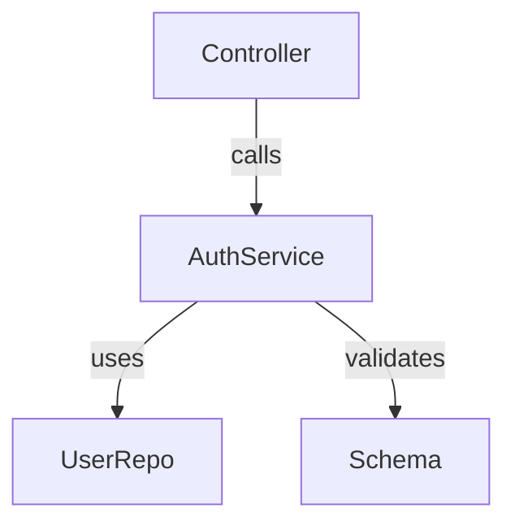
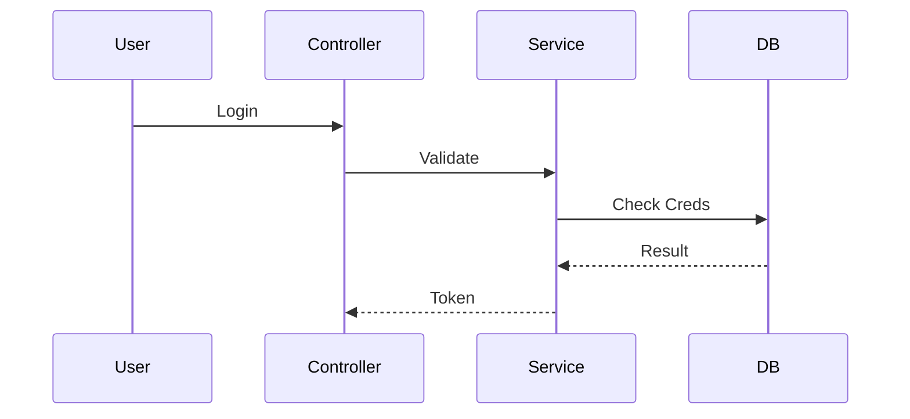

# Explain

$ARGUMENTS

Generates visual architecture explanations.

## Output Format

### 1. High-Level Role
"This module handles [Responsibility]. It interacts with [Dependencies]."

### 2. Dependency Graph (Mermaid)
Generate a graph showing imports/exports.


### 3. Key Flows (Sequence)
If logical flows are detected:


## Protocol
1. **Scan**: Read file contents to identify classes and functions.
2. **Link**: Identify imports to find collaborators.
3. **Visualize**: Generate standard Mermaid syntax.

## Automated Dependency Graph

Run the bundled script to extract imports and generate a Mermaid diagram:

```bash
python3 ${CLAUDE_SKILL_DIR}/scripts/dependency-graph.py src/auth.py
```

## Rules

- **MUST** start from what the user already knows — if it is unclear, ask one question before explaining
- **MUST** ground the explanation in the actual code (file:line references), not in generic framework theory
- **NEVER** use an analogy when a direct definition is clearer — analogies add a translation step for the reader
- **NEVER** produce a diagram that the text does not already justify — diagrams illustrate, they do not replace the explanation
- **CRITICAL**: when the code base is large, scope the explanation to one entry point plus its immediate collaborators. Explaining "the whole system" in one pass fails for any non-trivial project.
- **MANDATORY**: if the user asks for a short answer, give a one-paragraph summary without diagrams — not every request needs a Mermaid graph

## Gotchas

- Mermaid renders differently across GitHub, VS Code preview, and static generators. Features added post-2023 (e.g., class diagram relations, `accTitle`) may render as raw text on older renderers. Stick to the basic subset unless you know the target.
- `dependency-graph.py` parses imports statically; dynamic imports (`__import__`, `importlib.import_module`, JavaScript `await import()`) are invisible. Note explicitly when the generated graph is likely incomplete.
- Sequence diagrams have no notion of async vs sync. Two parallel calls render as sequential; distinguish with a `par` block or a note.
- Architectural explanations that name "the service layer" or "the controller" leak framework jargon. If the project does not use those terms, use the project's own names — otherwise the reader is translating twice.
- Long Mermaid graphs wrap awkwardly on narrow screens. For >20 nodes, split into a high-level graph and drill-down graphs rather than one giant diagram.

## When NOT to Use

- To critique or improve the code — use `/review` or `/refactor`
- To find a specific function across the codebase — use `/search` or `/explore`
- To write the documentation that the explanation turns into — use `/docs`
- For a full architecture audit or redesign — use `/architecture-audit`
- When the user asks "why is this broken" — use `/debug`, not `/explain`
