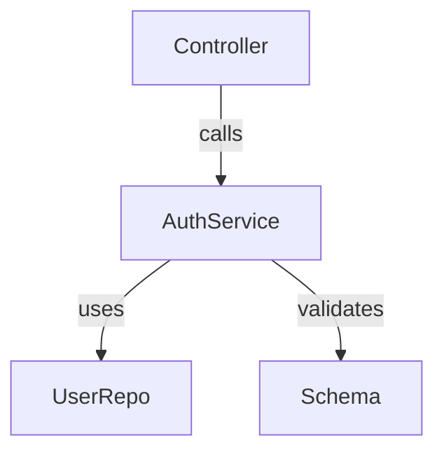
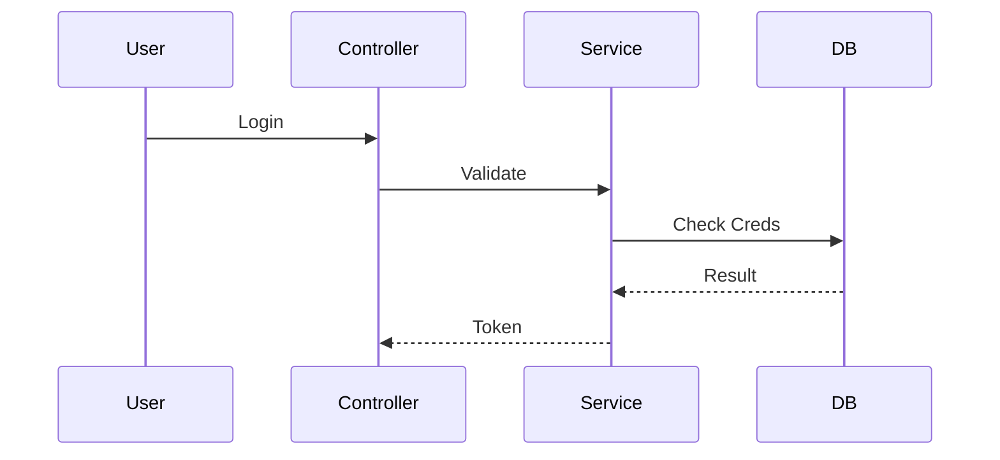

# Explain

$ARGUMENTS

Generates visual architecture explanations.

## Output Format

### 1. High-Level Role
"This module handles [Responsibility]. It interacts with [Dependencies]."

### 2. Dependency Graph (Mermaid)
Generate a graph showing imports/exports.


### 3. Key Flows (Sequence)
If logical flows are detected:


## Protocol
1. **Scan**: Read file contents to identify classes and functions.
2. **Link**: Identify imports to find collaborators.
3. **Visualize**: Generate standard Mermaid syntax.

## Automated Dependency Graph

Run the bundled script to extract imports and generate a Mermaid diagram:

```bash
python3 ${CLAUDE_SKILL_DIR}/scripts/dependency-graph.py src/auth.py
```
