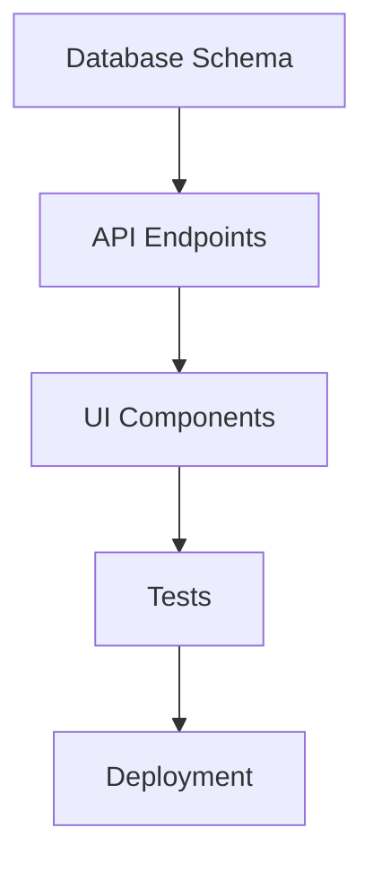

# Plan Writing Skill

## Plan Structure

### Basic Plan Template

```markdown
# [Project Name] - Implementation Plan

## Overview
- **Type**: [Project type]
- **Stack**: [Tech choices]
- **Complexity**: [Low/Medium/High]
- **Estimated Effort**: [Days/Weeks]

## Goals
1. [Primary goal]
2. [Secondary goal]

## Requirements

### Functional
| ID | Requirement | Priority |
|----|-------------|----------|
| FR1 | [Requirement] | Must |
| FR2 | [Requirement] | Should |

### Non-Functional
| ID | Requirement | Metric |
|----|-------------|--------|
| NFR1 | Performance | < 2s load |
| NFR2 | Security | OWASP compliant |

## Task Breakdown

### Phase 1: Foundation
- [ ] Task 1.1
- [ ] Task 1.2

### Phase 2: Core
- [ ] Task 2.1
- [ ] Task 2.2

### Phase 3: Polish
- [ ] Task 3.1
- [ ] Task 3.2

## Dependencies



## Agent Assignment

| Task | Agent | Dependencies |
|------|-------|--------------|
| Schema | database-architect | None |
| API | backend-specialist | Schema |
| UI | frontend-specialist | API |
| Tests | test-engineer | UI |

## Success Criteria
- [ ] All tests passing
- [ ] Performance targets met
- [ ] Security review complete

## Risks
| Risk | Probability | Impact | Mitigation |
|------|-------------|--------|------------|
| [Risk] | High/Med/Low | High/Med/Low | [Plan] |
```

---

## Task Breakdown Principles

### SMART Tasks
- **S**pecific: Clear deliverable
- **M**easurable: Done/not done
- **A**ssignable: One owner
- **R**ealistic: Achievable
- **T**ime-bound: Estimated duration

### Good vs Bad Tasks

| ❌ Bad | ✅ Good |
|--------|--------|
| "Implement authentication" | "Create login API endpoint with JWT" |
| "Build UI" | "Create user dashboard component" |
| "Fix bugs" | "Fix login redirect on mobile" |
| "Optimize" | "Reduce API response time to <200ms" |

---

## Dependency Management

### Dependency Types

| Type | Example |
|------|---------|
| **Hard** | API must exist before UI can call it |
| **Soft** | Tests can start when 50% features done |
| **External** | Waiting for third-party API access |

### Identifying Dependencies

```
For each task, ask:
1. What must exist before this can start?
2. What does this task produce?
3. Who/what consumes that output?
```

---

## Estimation Patterns

### T-Shirt Sizing

| Size | Effort | Example |
|------|--------|---------|
| XS | <2 hours | Fix typo, add field |
| S | 2-4 hours | Simple component, basic API |
| M | 1-2 days | Feature with tests |
| L | 3-5 days | Complex feature |
| XL | 1-2 weeks | Major subsystem |

### Cone of Uncertainty

| Phase | Accuracy |
|-------|----------|
| Initial idea | 4x variance |
| After discovery | 2x variance |
| After design | 1.5x variance |
| After development | 1.1x variance |

---

## Phase Templates

### MVP Launch

```
Phase 1: Core (Week 1-2)
- Database schema
- Authentication
- Core feature 1

Phase 2: Essential (Week 3-4)
- Core feature 2
- Basic UI
- Critical integrations

Phase 3: Launch (Week 5)
- Testing
- Deployment
- Documentation
```

### Feature Addition

```
Phase 1: Preparation
- Research existing code
- Define acceptance criteria
- Design solution

Phase 2: Implementation
- Backend changes
- Frontend changes
- Integration

Phase 3: Validation
- Testing
- Code review
- Deploy to staging
```

---

## Review Checklist

Before finalizing plan:
- [ ] All requirements captured
- [ ] Tasks are SMART
- [ ] Dependencies identified
- [ ] Agents assigned
- [ ] Risks documented
- [ ] Success criteria defined
