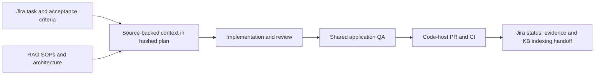

# Autonomous software development

`/autonomous-dev` owns delivery from a task to a verified ready PR. The agent
running in your current client performs the work. A bundled journal records
ownership, stages, attempts and evidence; it is not a daemon or an LLM runtime.

The process adapts the chaining, recovery and shared-QA ideas in
[Open Mercato skills](https://github.com/open-mercato/skills/tree/91f11c63721b5f7e17a859940b3e9c55ece698ee)
to ai-toolkit's existing skills, native generators and per-repository state.
The helper implementation is original; installing this process does not fetch
or install the upstream skill collection.

## Start a run

Install/update ai-toolkit using the existing project/client setup procedure.
The two new skills are part of the core catalog. In a client with skills:

```text
/autonomous-dev setup
/autonomous-dev run "Add CSV export for filtered orders"
/autonomous-dev run PROJ-123
/autonomous-dev run https://example.atlassian.net/browse/PROJ-123
/autonomous-dev run path/to/approved-spec.md
/autonomous-dev run https://github.com/organization/project/issues/42
/autonomous-dev run https://github.com/organization/project/pull/43
```

`/workflow autonomous-development <task>` is another entry to the same process.
Use the skill name exposed by the current client if it applies a namespace.
Clients without executable tools can read the guidance but cannot run the full
process. Native subagents and browser tooling depend on the client; the skill
preserves its configured models and permissions.

Setup inspects actual project instructions, runtime scripts and CI. It records
the PR base, validation commands, separate task/code providers, knowledge sources,
browser provider and applicable gates
in `.ai-toolkit/autonomous.json`. This intentional configuration can be reviewed
with the project. Missing configuration does not require an external service.
For the schema and an Open Mercato configuration mapping, see
[project-config.md](../../app/skills/autonomous-dev/reference/project-config.md).

## RAG MCP and Jira MCP

Use three explicit roles in the project config:

| Role | Our stack | Responsibility |
|---|---|---|
| `issueTracker` | `jira-mcp` | Jira task identity, acceptance criteria, language and workflow |
| `codeHost` | GitHub | Repository, PR, review and required CI |
| `knowledge` | `rag-mcp` | Project SOPs, architecture and testing rules, filtered by actual services |

The readonly `delivery-config.py` helper validates this profile and normalizes a
Jira key and browse URL to the same run subject. It does not verify remote
permissions, connector availability, live transitions or the task-to-repository
mapping. The existing GitHub `tracker` shorthand remains compatible. Other code
hosts require their own supported PR integration; configuring Jira does not add one.



At discovery and resume, refresh the scoped Jira task with `sync_tasks` and then
`get_task_details`; read the configured project language before writing text and
available transitions before changing status. Fetch RAG documents by `kb_id`,
resolve filesystem paths against their real source repository and record the
used content/digests in the hashed plan. Refresh these inputs before finalization,
even when Git HEAD has not changed. New acceptance criteria invalidate old proof.

Jira comments require the actual tool's content approval. The current connector
has no edit-comment or idempotency-key tool: use a visible run/stage/SHA marker,
persist the returned receipt, and reconcile comments after a timeout before
retrying. Project config cannot grant posting permission. `ready-pr` leaves Jira
at its real status unless a configured, authorized transition applies; it never
means automatic Jira Done.

KB file updates and indexing are separate. Record `not-required`, `pending` or
`verified` in the handoff. Use an available, configured indexing mechanism only
when authorized, and verify its step results plus retrieval of the expected
document. The current RAG MCP connection may have no write/index tool. Neither
HTTP acceptance nor a job's done flag alone proves that the index was refreshed.

The full operational sequence and receipt fields are in
[stack-integrations.md](../../app/skills/autonomous-dev/reference/stack-integrations.md).

## What runs autonomously

| Stage | Result |
|---|---|
| Discover | Real task scope, existing work, repository and source identity |
| Plan | Acceptance criteria, owned slices, actual commands and assumptions |
| Implement | Reviewed source changes, regression tests and affected docs |
| Validate/review | Results tied to the exact source and immutable reports |
| QA | Verified environment provenance and applicable behavioral evidence |
| Publish/CI | Same PR, current remote head and required check results |
| Complete | Clean verified source, successful attempt, intact plan/evidence |

Previously granted approval remains valid across phases. Routine reversible
implementation decisions proceed within that scope. Missing business decisions
and host permissions remain real blockers. The default endpoint is `ready-pr`;
merge, release and deployment require separate explicit authorization.

The process invokes existing planning, development, review, test and PR skills.
It assigns independent subagent work when supported, with explicit file
ownership. Review must address the acceptance criteria and existing feedback.
Local AI review does not substitute for required human approvals on GitHub.

## State and recovery

The default store is:

```text
~/.softspark/ai-toolkit/sessions/<primary-repo-path-with-slashes-replaced>/autonomous/
  runs.sqlite3
  <run-id>/artifacts/
```

Linked worktrees share a canonical Git repository identity and this store.
Each run has a stable source subject and a per-session owner token. Transactions
prevent competing sessions on the same store from mutating another session's
run. This is a local coordination mechanism; it is not a distributed lock for
agents on separate machines. Tracker ownership signals remain advisory.

```text
/autonomous-dev list
/autonomous-dev status <run-id>
/autonomous-dev resume <run-id>
```

List discovers this repository's runs without requiring an ID or creating state.
Status does not mutate state. Resume verifies the current worktree, owner and
evidence before continuing. A deliberately released run can be claimed by a
new session. An active foreign owner needs an explicit handoff or authorized
takeover, identifying the previous owner and reason. Rebinding a replacement
worktree is explicit and requires the same clean branch, commit and contents.
For a custom journal `--store`, preserve that path in the handoff; the default
store lookup cannot discover a separately located fixture store.

The journal permits at most five attempts, halts after three consecutive failed
attempts and requires at least 60 seconds between starts. Those limits survive
resume and takeover. Multiple failed gates within one cycle count once. Do not
create a new run to reset an exhausted budget.

Reports and plans are hashed. Missing, empty, modified or source-stale reports
cannot satisfy completion. Changing a plan invalidates previous verification.
Hidden index flags, dirty submodules and uninitialized submodules prevent a
clean-source claim. The helper never clears flags or changes the target's Git
state. Inspect and resolve the underlying source state deliberately.

For exact helper operations, see
[run-state.md](../../app/skills/autonomous-dev/reference/run-state.md).

## QA and evidence

`/prepare-test-env` discovers the project's actual launch/build commands and
records a shared `test-env.json` under the run directory. It checks the clean
source revision and HTTP readiness. A successful HTTP response alone does not
prove which build the server is running: establish launch/build provenance and
resource ownership, or use an existing application identity endpoint.

The helper does not start or stop services and does not add product API routes.
The agent uses authorized project tools, runs the changed acceptance scenarios
and records browser/E2E artifacts. It may stop only resources created by that
run after checking their creation identity. Unknown or shared services remain
untouched.

Commit source before final QA, and keep reports outside the checkout. A source
change requires new evidence. An unavailable browser is a blocker when browser
QA is required. For non-UI work, a gate declared optional during setup may have a
reasoned `not-applicable` report, backed by the relevant API/CLI tests. The same
rule applies to a repository that genuinely has no required CI.

## Verification scope

The repository tests use real temporary Git repositories, concurrent SQLite
claims, local HTTP servers and detached native skill installations. They verify
deterministic helper behavior and resource packaging. They do not prove that an
LLM will always implement a correct feature, nor do they exercise a live hosted
PR provider. The current agent must inspect actual test/browser/tracker results
before recording reports. Host shutdown stops execution; resume starts it again.

Related: [maintenance SOP](../procedures/sop-maintenance.md),
[skills catalog](../reference/skills-catalog.md),
[completed implementation plan](../history/completed/autonomous-development-plan.md),
[tracker contract](../../app/skills/autonomous-dev/reference/tracker.md).
